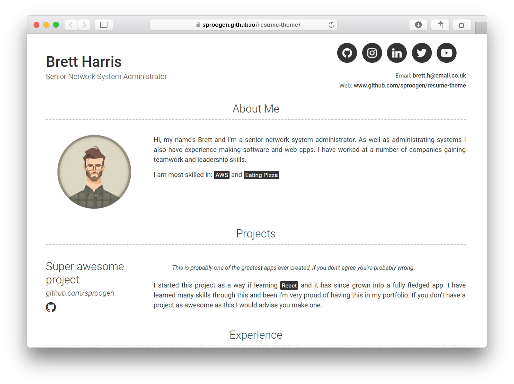

# modern-resume-theme [](https://badge.fury.io/rb/modern-resume-theme) [](https://travis-ci.org/sproogen/modern-resume-theme)

*A modern simple static resume template and theme. Powered by Jekyll and GitHub pages.*
*Host your own resume on GitHub for **free!***

[View Demo](https://sproogen.github.io/modern-resume-theme/)



*Thank you for checking out my resume theme / template. If you have any feedback or suggestions for things I can add please let me know by either by raising an [issue](https://github.com/sproogen/modern-resume-theme/issues/new/choose) or feel free to send me an email to [sprog31@gmail.com](mailto:sprog31@gmail.com), I'm always happy to help.*

*I always enjoy seeing how people are using my creations and if you would like to say thanks feel free to [buy me a coffee (buymeacoffee.com/vJ6HfLu)](https://buymeacoff.ee/vJ6HfLu).*

[](https://www.buymeacoffee.com/vJ6HfLu)

*If you would like to see how I am using this then you can view my resume [here (jameswgrant.co.uk)](http://www.jameswgrant.co.uk/) and find the code [here (sproogen/jameswgrant)](https://github.com/sproogen/jameswgrant), hopefully this might help you.*

You can view the project [roadmap here](https://github.com/sproogen/modern-resume-theme/projects/1).

## Installation & setup guide
This template is designed to be hosted using GitHub pages and so that's what these instructions will cover. If you plan on hosting it seperately then there might be some extra steps that we wont cover.

Before starting it might be useful to familiarise yourself with [Jekyll](https://jekyllrb.com/docs/home/), [Markdown](https://www.markdownguide.org/getting-started) and [GitHub pages](https://pages.github.com/).

##### Step 1 - GitHub
Start by creating an account on [GitHub](https://github.com/join)

##### Step 2 - Create Repository
Create a repository on GitHub to hold your files and host your resume. You can find out how to do that [here](https://pages.github.com/)

##### Step 3 - Download Resume Template
Download and extract the following zip into the git repository you have just created. [resume-template.zip](https://github.com/sproogen/modern-resume-theme/archive/gh-pages.zip)

##### Step 4 - Push it
Commit and push the resume template to github
```
$ git add --all
$ git commit -m "Initial resume setup"
$ git push -u origin master
```
##### Set 5 - See it
You should now be able to see the demo resume template using this theme at `[your-username].github.io`

## Usage

So now you will be able to see the demo template at your github url. You can can edit the yml files and replace the demo content with your own. Hopefully it will be fairly simple to work out where all the content goes, but here is a quick overview.

##### _config.yml
This will contain all the of the main configuration for your resume such as your name, email, social media links and about me content. It will also allow you to change the titles of some of the content sections.
A full example of the _config.yml can be found [here](https://github.com/sproogen/modern-resume-theme/blob/master/_config.yml)

##### _data/education.yml
A list of all your education, each education will follow this format
```
- name: Institution name
  dates: Date Range (eg. 2016 - 2019)
  qualification: Qualifications (eg. BA Performing Arts)
  quote: >
    Short institution or course description (optional)
  description: | # this will include new lines to allow paragraphs
    Description of qualification
```

##### _data/experience.yml
A list of all your experience, each experience will follow this format
```
- company: Company name
  link: Link to company (eg. https://google.com)(optional)
  job_title: Job title
  dates: Date Range (eg. November 2016 - present)
  quote: >
   Short description of the company (optional)
  description: | # this will include new lines to allow paragraphs
    Description of role
```

If you wish to specify multiple titles for a single company, use this format
```
- company: Company name
  link: Link to company (optional)
  jobs:
    - title: Job title 1
      dates: Date Range (eg. November 2016 - present)
    - title: Job title 2
      dates: Date Range (eg. January 2015 - November 2016)
  quote: >
   Short description of the company (optional)
  description: | # this will include new lines to allow paragraphs
    Description of role
```

##### _data/projects.yml
A list of all your projects, each project will follow this format
```
- name: Project name
  link: Link to project (eg. https://sproogen.github.io/modern-resume-theme)(optional)
  github: Github page for project (eg. sproogen/modern-resume-theme)(optional)
  quote: >
    Short overview of the project (optional)
  description: | # this will include new lines to allow paragraphs
    Description about the work on/with the project
```

## Running locally

Before you start make sure you have *Ruby* and the gems for *Jekyll* installed locally. You can find out how to do that [here](https://jekyllrb.com/docs/installation/).

1. Clone your resume repository locally *(if you haven't already)*
2. `cd [your-repository-name]`
3. `bundle install`
4. `bundle exec jekyll serve`
5. Open your browser to `http://localhost:4000`

Any changes you make will automatically build and you will be able to see these by refreshing your browser.

*Note: You will need to re-run `bundle exec jekyll serve` to see changes made in `_config.yml`.*

## Contributing

Bug reports and pull requests are welcome on GitHub at https://github.com/sproogen/modern-resume-theme. You can view our full guide to contributing [here](https://github.com/sproogen/modern-resume-theme/blob/master/CONTRIBUTING.md)
This project is intended to be a safe, welcoming space for collaboration, and contributors are expected to adhere to the [Contributor Covenant](http://contributor-covenant.org) code of conduct.

## Development

Before you start make sure you have *Ruby* and the gems for *Jekyll* installed locally. You can find out how to do that [here](https://jekyllrb.com/docs/installation/).

1. Fork and or clone this repository locally
2. `cd modern-resume-theme`
3. `bundle install`
4. `bundle exec jekyll serve`
5. Open your browser to `http://localhost:4000`

Any changes you make will automatically build and you will be able to see these by refreshing your browser. To find out more about *Jekyll* take a look [here](https://jekyllrb.com/docs/usage/).

*Note: You will need to re-run `bundle exec jekyll serve` to see changes made in `_config.yml`.*

## License

The theme is available as open source under the terms of the [MIT License](https://opensource.org/licenses/MIT).
